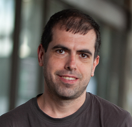
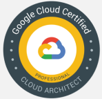

# Serhii Belei

Software Architect (16-February-2024)

## Summary of qualifications

I have 10+ years of experience in software development. I started my jorney with Pascal/Delphi for 5 years. Then 7+ years I worked with Java stack. And 2 years mostly with groovy and last couple of month (up to year) with TypeScript/React/NodeJS. Aftewards I worked last year as an architect with Java project.

I've been working as a Software Architect/Tech lead, for last year. Despite driving main project I was involved in different consultancy and investigation activities. I have strong technical experience of Software Development processes, including analysis, requirements design, data modeling, coding, testing, debugging using Java. Also I had some experience with Typescript/React/NestJS.

I'm interested in development of reliable and maintainable software. However I understand that we have wide range to reach business needs. I have experience in development of complex business models using modern TDD and BDD approaches. Setting up code quality and test quality standards in the team. I'm fast learner and passionate to learn new ideas and technologies.

I really like to create own tools which I need and can't find suitable (see my open-source projects). Also I like to share knowledge on online and offline meetups (see my publications)
My hobbies used to be jogging, programming and electronics and also hiking. I like car traveling, aviation, and fantasy movies and books

## Skills

### Software Architecture Design

- Software Architecture Design/ UML/ Reverse Engineering/Design Patterns
- Quality Attribute Workshop
- Technical Documentation/Architecture Reports/Proposals/SRS
- Views and beyond (SEI)
- C4 Diagrams
- Domain driven design
- Service-Oriented architecture

### Programming Languages/ Technologies

- Java/Groovy/Gradle/Maven/Ant
- TypeScript/React/Nest/NodeJS/NPM
- Python
- Borland Delphi/ADO/Pascal
- FHIR

### Cloud

- GCP
- AWS

### RDBMS

- PostgreSQL/MySQL/MS SQL Server/OracleDB/MS Access
- Proprietary NoSQL DB
- Google Spanner

### Methodologies

- Agile, SCRUM, XP
- Views and beoynd (SEI)
- Architecture traydoff analysis
- Pair Programming
- Test Driven, Feature Driven, Behavior Driven Development
- Waterfall

### Frameworks

- Grails
- Spring (batch, core, jdbc-template, rest, data, mvc)
- Jersey
- myBatis/Hibernate
- Concordium/Selenium/JUnit/JMock/Mockito
- React/Nest

### Application/Web Servers

- Apache Tomcat
- IBM WebSphere
- Oracle Weblogic

### Development Tools (IDE, SCM, CI)

- Eclipse/Intellij Idea/VSCode
- Git/SVN
- Github actions/Jenkins/Teamcity/Travic-CI
- Docker/Kubernetes/Newrelic/Grafana

### Operating Systems

- Microsoft Windows 3.11/95/ 98/XP/Vista/Seven/10
- openSUSE Linux / Ubuntu Linux / FreeBSD 4 / RedHat Linux

### Hardware

- Communication with scales & cash registers
- Communication with pole displays
- Communication with bar-code and magnetic card readers
- Communication with laser transmitter over LPT port

## Open-source projects

- Gradle plugin for Jenkins, Maintainer, <https://github.com/crc83/gradle-jenkins-plugin>
- Rally plugin for Jetbrains IDEA, Author and maintainer, <https://github.com/crc83/rallydev>
- Total Commander plugin for Git <https://github.com/crc83/tc-git-plugin>
- Project aimed to train kids write letters (JavaScript only) <http://crc83.github.io>  (repo <https://github.com/crc83/crc83.github.io> )

## My publications

### Presentation at JEEConf 2018

- Gradle how to's <https://youtu.be/7b17sOKuOS8>

### Presentation for local developers community

- Make diagrams a communication channel between stakeholders <https://youtu.be/oVAPcHOYZEQ>
- ANTLR4 for beginners <https://youtu.be/qejsv35H33Q>
- GCP Spanner <https://youtu.be/r2ebX8Uqeao>
- TDD in legacy projects <https://youtu.be/Jujc5X3Z9v8>

Blog :  <http://crc83.blogspot.com/>

## Experience

### Supply chain for retail

| Project Description: | Supply chain project for retail as a part of big enterprise SOA with domain driven design and multiple integrations with other services through REST and message bus |
| Customer: | EU customer |
| Involvement Duration: | September 2023 - Now |
| Project Role: | Technical leader |
| Responsibilities: | Scoping epics. Proposing solutions and defining enhancement of contracts. Time and schedule negotiation |
| Project Team Size: | 20+ |
| Tools/ Technologies: | Java/AVRO/Openapi |

### Helthcare support marketplace

| Project Description: | Project aimed to support customers with hiring nurse or nanny to support them in daily life. Project itself contains of legacy monoliths and go microservices on backend and micro frontend app combined with JSP's on frontend |
| Customer: | US customer |
| Involvement Duration: | May 2023 - September 2023 |
| Project Role: | Software engineer |
| Responsibilities: | Maintenance of application: Release of go microservice. Scoping epics |
| Project Team Size: | 5-6 |
| Tools/ Technologies: | Java/JSP/Spring/Go |

### Helthcare information system

| Project Description: | Project aim is to automate work of hospitals, clinics etc. It has modular monolithic structure with Java/Spring backend and Angular frontend. My team responsibility was to implement interaction with patient and doctor cards and also interaction with government services via HL7 data standards (FHIR JSON data models) |
| Customer: | EU customer |
| Involvement Duration: | August 2021 - April 2023 |
| Project Role: | Architect |
| Responsibilities: | Maintaining technical documentation explaining our soultions. Conducting technical discussions and documenting outcomes. Design of small modules. Cooperation with architects of other modules |
| Project Team Size: | 3 - 10 |
| Tools/ Technologies: | Java/Spring & Angular |

### Healthcare social network

| Project Description: | Project aimed to help senior people communicate with each other. It has microservice architecture with different data analytics and data aggregation services |
| Customer: | US customer |
| Involvement Duration: | November 2020 - July 2021 |
| Project Role: | Lead engineer/Architect |
| Responsibilities: | Project handover and discovery. Documenting existing state and environment. Onboarding of new team members and knowledge transfer |
| Project Team Size: | 3 - 10 |
| Tools/ Technologies: | React/NodeJS/NestJS/AWS |

### Healthcare ETL system

| Project Description: | This platform provides services to multicultural populations including those that speak English, Spanish, Arabic, Farsi, Mandarin, Cantonese,Armenian, Tagalog, and others. |
| Customer: | US customer |
| Involvement Duration: | September 2020 - November 2020 |
| Project Role: | Software developer |
| Responsibilities: | Regular development |
| Project Team Size: | 3-6 |
| Tools/ Technologies: | Java/Spring Batch/Angular |

### Tennis booking system

| Project Description: | Project aimed to help venues in their daily activity. Also this solution helps players to book a match and find partner for it. |
| Customer: | Swedish customer |
| Involvement Duration: | November 2019 - September 2020 |
| Project Role: | Software developer |
| Responsibilities: | Regular development/Manual testing |
| Project Team Size: | 6 |
| Tools/ Technologies: | Grails/MySQL |

### Web service that provides read only data

| Project Description: | Web service that provide information to different clients under heavy load. |
| Customer: | US Customer |
| Involvement Duration: | June 2019 - September 2019 |
| Project Role: | Migration of gradle build scripts from Gradle 1.x to latest at that time (Gradle 5) |
| Responsibilities: | Change build scripts, verify that projects has been built well and provide instructions how to use and extend these builds. Simplify environment configuration (I proposed to use docker compose) |
| Project Team Size: | 1 |
| Tools/ Technologies: | Gradle/Groovy/Docker/Jenkins |

### POC Migration to GCP Spanner

|Project Description: |Migrate existing REST based services from DB2 to GCP Spanner. Performance metrics gathering and queries performance tuning.|
| Customer: | US Customer |
| Involvement Duration: | January 2019-May 2019 |
| Project Role: | Developer |
| Responsibilities: | Regular development. Discovering bottlenecks and adjusting queries |
| Project Team Size: | 3 |
| Tools/ Technologies: | Spring boot, Google Libraries for Spanner, Jetbrains IDEA, GCP Console |

### Application Release automation and test automation support

| Project Description: | Migration of build process from Ant to Gradle. Automation of release process. Writing UI automation tests using groovy & selenium2. Moving common build tasks from gradle script into plugins using groovy. Automation of Jenkins job configuration from gradle build (Maintenance of opensource gradle Jenkins plugin, written on groovy) |
| Customer: | European customer |
| Involvement Duration: | October 2017-October 2018 |
| Project Role: | Technical leader, Team leader, Software engineer |
| Responsibilities: | Requirement clarification, Estimation and project planning, Implementation of solutions |
| Project Team Size: | 3 |
| Tools/ Technologies: | Eclipse, Gradle, Jenkins, Artifactory, Groovy, Seleinium 2 |
| My articles related to: | Gradle plugin development using groovy: <http://crc83.blogspot.com/2016/03/i-getting-started-with-environment.html> |

### Meta Application development based on proprietary technologies

| Project Description: | Proprietary OONDB (object-oriented network database), ORM framework for OONDB, ZK UI framework. |
| Customer: | European customer |
| Involvement Duration: | January 2014- October 2017 |
| Project Role: | Technical leader, Team leader, Software engineer |
| Responsibilities: | Requirement clarification, Estimation and project planning, Implementation of solutions |
| Project Team Size: | 6-10 |
| Tools: | Eclipse, Gradle/Ant, Tomcat 7, Java 6, ZKoss UI framework |

### Online booking service

| Project Description: | Product that connects Home Rental Agreement (HRA) owners and property managers with travelers who seek the space, value and amenities of HRA homes as an alternative to hotels. |
| Customer: | US Customer |
| Involvement Duration: | February 2013-December 2013 |
| Project Role: | Software engineer |
| Responsibilities: | Maintenance, Implementation of new features, Issue resolving |
| Project Team Size: | 18-30 |
| Tools/Technologies: | Maven 2, Eclipse/Intellij IDEA, Git, Spring, MyBatis, Jersey |

### Development process management tool

| Project Description: | Tool based on top of SVC client that allows developer easily switch context of development. It also integrates with issue tracker and continuous integration server. |
| Customer: | US Customer |
| Involvement Duration: | December 2012 - February 2013 |
| Project Role: | Software engineer |
| Responsibilities: | Implementation of new features on top of existing architecture |
| Project Team Size: | 2 |
| Tools/Technologies: | Ruby |

### Database migration project

| Project Description: | Perform data migration from Oracle DB to MySQL database. This includes input and output data verification. |
| Customer: | US Customer |
| Involvement Duration: | June 2012 - November 2012 |
| Project Role: | Software engineer |
| Responsibilities: | Perform data migration, Find and resolve issues during migration process (in migration application codebase, in data inputs and outputs) |
| Project Team Size: | 1 |
| Tools/Technologies: | Eclipse, Ant, Bash, JUnit, JDBC |

### Meta Application development based on proprietary technologies

| Project Description: | Proprietary OONDB (object-oriented network database), ORM framework for OONDB, ZK UI framework. |
| Customer: | European customer |
| Involvement Duration: | July 2011 - May 2012 |
| Project Role: | Software engineer |
| Responsibilities: | Components design, Implementation of solutions, Testing solutions, Automation of testing process |
| Project Team Size: | 3 |
| Tools/Technologies: | Eclipse, Ant, Tomcat 7, Selenium, Concordium, Java 6, ZKoss UI framework |

### Business operation program customization

| Project Description: | The aim of the project was to customize third party open source libraries to run on environment with J2EE security restriction. The program or any of its components shouldn't create classloader, set context class loader and also have read or write access to temp folder. |
| Customer: | European customer |
| Involvement Duration: | February - July 2011 |
| Project Role: | Software engineer |
| Responsibilities: | Implementation of solutions; Testing solutions; Automation of delivery preparation process; Automation of testing process |
| Project Team Size: | 3 |
| Tools/Technologies: | Eclipse, Ant, Maven, WebSphere 7, Java 6, Axis2, Scripting (Windows/Linux/VBA Excel) |

### POS system for cafe and store

| Project Description: | Project intended to automate business processes in cafe or store. It must be easy to use and have unified user interface. |
| Customer: | UA Customer |
| Involvement Duration: | 2006-2010 |
| Project Role: | Software engineer |
| Responsibilities: | Developing and implementation of object model, covering object model by tests, UI design, developing database scripts, making technical documentation about object model, making user manual, support and maintenance |
| Project Team Size: | 2 |
| Tools/Technologies: | Delphi 7-2010, MS SQL Server 2005 Express edition, ADO, COM |
| Additional information: | Many different tasks were solved by me, such as: interaction with cash registers; interaction with scales; flexible distribution of access rules between different users; operation logging. I have an experience of supporting this application for four years |

## Programming languages

| Programming languages: | Level |
|----|----|
| Java | good |
| Groovy | good |
| Component Pascal | average |
| Python | beginner |
| TypeScript | beginner |
| JavaScript | average |

## Network contacts

- GitHub : <https://github.com/crc83>
- Blog : <http://crc83.blogspot.com/>
- LinkedIn : <http://ua.linkedin.com/pub/sergiy-beley/24/b2b/559/>
- Skype : sergiy.beley
- Telegram : <https://t.me/crc83>
- Phone : +380993231704
- E-mail : <sergiy.beley@gmail.com>

## Certifications

| Name | Year |  |
|----|----|----|
| Java Standard Edition 6 Programmer Certified Professional | 2012 |    |
| Google Cloud Certified Professional Cloud Architect <https://bit.ly/32eHIiV>  | 2019 |  |
| SEI Software architect professional | 2022 |  |

## Education

M Sc Degree
Ivano-Frankovsk oil and gas university
Faculty of electrification and informational and measurement technologies
2005
